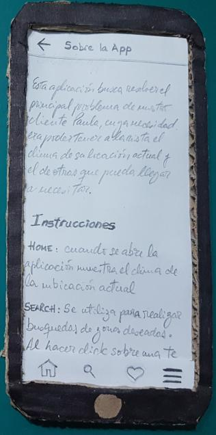
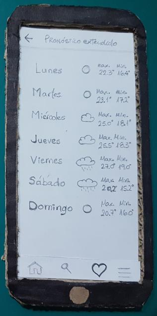
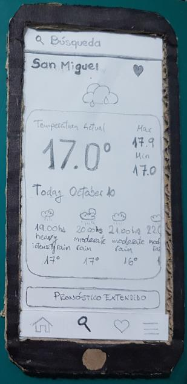
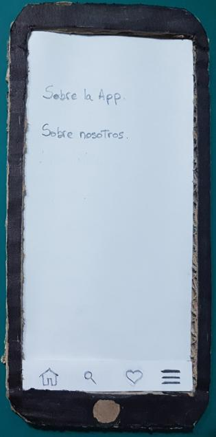
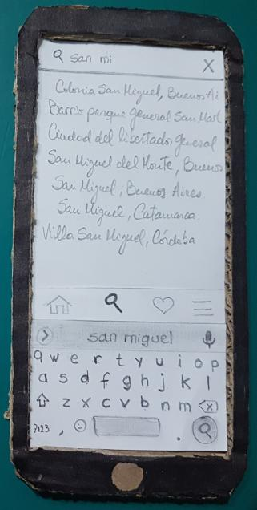
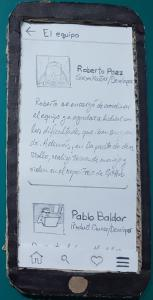
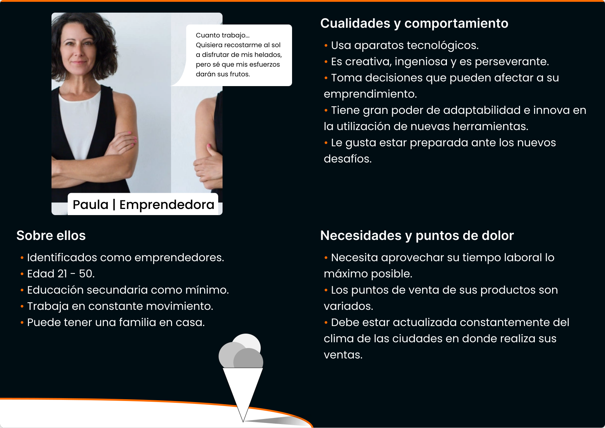

## Instrucciones para correr el proyecto:

1.  Realizar la guia "Environment setup" con React Native CLI, en la plataforma correspondiente, de la documentación de el sitio de react-native.

    https://reactnative.dev/docs/environment-setup

2.  Desde Git Bash clonar el repositorio del proyecto.

        https://github.com/PabloBald/Curso-React-Native-IBM-Skillbuild.git

3.  Leer instrucciones del archivo .rnenv-example.js para generar la key utilizada por la API

4.  Dentro de la carpeta del proyecto ejecutar los siguientes comandos:

        npm install / yarn install (según corresponda)

5.  Ejecutar el proyecto utilizando el comando:
    react-native run-android / run-ios (según corresponda)

----
## Paper Prototyping

El prototipo del diseño se hizo, en primera instancia a mano y luego se proyecto con la herramienta [Figma](https://www.figma.com/)

Expandir/Contraer

  

  

----

## Persona Canvas de Paula:

Para realizar el diseño utilizamos la herramienta [Figma](https://www.figma.com/)

Expandir/Contraer

Puede descargar el pdf haciendo click [aquí](src/assets/readme/Paula.pdf)

---
